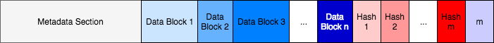

# Write Once File System

This project implements an archival write-once file system (WOFS) using the [FUSE](https://github.com/libfuse/libfuse "FUSE Documentation") library. 

The write-once file system has 2 main components, mastering and mounting. The mastering program takes in a relative path to the directory to be imaged, the image output name, and a key. It produces two output files: 
1. An image file complete with HMAC and ECC (described in more detail below) with the desired output name. 
2. An image file without ECC with the desired output name with the 'necc' extension appended. 

The mounting program takes in either a image with or without ECC and a key and mounts the image to the desired location. Prior to this process it applies ECC (if that option is set) and verifies the validity of the image structure. 

The tree program is an additional program that takes in an image file an outputs the file structure. It is helpful in verifying the validity and structure of image files without mounting. The tree program is designed to take in a pure image file with no ECC. A file with ECC can be extracted to an image file without ECC using the `decode` method in the `ecc.cpp` file.  

## On-Disk Structure 

The on-disk structure is divided into three main sections:
1. Metadata section 
2. File data
3. Hashes 

The metadata section and file data are made into blocks of fixed size and each block is hashed with the key appended. Each hash is of fixed size (32 bytes). There is an additional integer appended to the end of the on-disk structure to indicate how many hashes are present. 

##### Imaging 

The file structure is imaged in a DFS fashion. This is best seen through an example:

Above is a sample file structure. dirA is the root directory, with two subdirectories dirB and dirC. dirB has one subdirectory, dirD, that holds a single file, a.txt. The imaging process would produce the following header structure on disk:

The first header is dirA, the root. Each header is indicated in blue. Directory headers are followed by a list of offset that point to the location of their child directories. The two gray offsets following the dirA header block point to its children dirB and dirC. dirB is the next header on disk. It has an offset list with one element, which points to dirD. dirD also has one element, an offset that gives the location of the a.txt header block. The a.txt header block points to the offset of its data in the data section of the image. 

Once, the headers of **all** of dirB's contents are written to disk then dirC is written to disk. For this reason the imaging follows closely a DFS, opposed to a BFS approach. In other words, the imaging process traverses the depth of the structure until it hits leaf components, rather than writing layer by layer. This implementation was chosen because it is difficult to write the structure to disk without knowing the *total* number of elements under a given directory. Therefore, the depth first approach is preferred. We suspect that the performance between the two approaches is neglible and depends on the access pattern. Either way a majority of the header section should be in cache and we do not anticipate the traversal method having an impact on performance. 

## Theory

### Reed Solomon
Our project allows for error corrections through Reed Solomon correction codes.  More specifically, we divide the image file into blocks of XXXX bytes, and then add code on the end in order to correct up to XXX byte level errors. These blocks are then saved in order in a copy of the file, rendering unreadable to the previous progams, but now safely packaged to prevent errors.  Once the file is in its final destination, these same parameters are read in to decode the blocks and write the file out in its original form.

### Sha256
in order to prevent any tinkering with the file from malicious sources, we save a simple sha256 hash of the original file with a secret.  This hash is then appended to the file after Reed Solomon was applied.  Sha 256 works by creating a 256 bit hash of any provided code, when a secret word is used in addition to the data, then only other with knowledge of the secret key will be able to reproduce a working hash.  This allows us to ensure that the data has not been tampered with in transition, and further allows us to check that the ECC has recreated the correct data.  

## Usage

### Mastering (master.cpp)

Compile: `g++ -std=c+11 -g master.cpp -o master.out -lcrypto`

Run: `./master.out [parameters]`

Parameters: 
* -o/--out=: output file name
* -p/-path=: path to directory/file to image
* -k/--key=: key for sha256 hash
* -n/necc: Do not error correcting - output file name with ".necc" appended

Mastering is broken down into a linear pipeline (shown above). First the target directory is traversed and a image file is created. Then the image is hashed (potentially in multiple blocks) and its hash is appended. Finally, ECC is applied on a block level to the image. 

### Tree Script (tree.cpp)

Compile: `g++ -std=c+11 -g tree.cpp -o tree.out`

Run: `./tree.out [image_file]`

### Mounting (mounter.c)

Compile: `g++  -std=c+11 -Wall -g mounter.c 'pkg-config fuse3 --cflags --libs' -o mounter.out -lcrypto `

Run: `./mounter.out [parameters] [mount point]`

Parameters: 
* --image=: path to image
* --key=: key for sha256 hash (decode)
* -h/--help: help
* --necc: flag to do no error correcting before mounting
* Any other FUSE flags 

Mounting follows a linear pipeline. It takes the input file and error corrects it, unless indicated by the --necc flag not to. Then the program verifies the validity of the image by appending the key to the image and hashing it. This hash is compared to that recorded on the image. Then the file system is mounted. The image file is then traversed to handle any necessary incoming IO requests on the mounted image. 

## Testing 

### Stress-test.py 

Input: 
* VERBOSE_FLAG: a boolean flag to indicate whether or not to print the results of each comparisson as the test is run.
* ITERATIONS: number of times to traverse the mounted file structure. 
* mount_point: relative path from the location of the test to the mounted file directory.
* true_path: relative path from the location of the test to the directory that was imaged. 

stress-test.py is a script that tests the functionality and validity of the mounted image. It does so by first getting and comparing the structures of the orginal and mounted directories. It then traverses this structure and ensures that all desired attributes about the original and mounted directories are the same. The test ensures: 

1. The structures of the original and mounted file directories are the same. 
2. Files between the two have identical content and size.
3. Directories between the two have the same list of children. 

## Limitations 

#### File sizes 

The mastering and mountering programs in theory are constrained by the memory available to read and write the necessary files. However, FUSE reads files in 131,072 bytes blocks. In other words, a complete read of a 1 MB file causes FUSE to trigger ~8 reads. As one would expect this puts a serious performance limitation on large files. Therefore, the WOFS is intended for maximum file sizes greater than 100 MB. Efforts were made to expand this 131,072 block size limit - however, it appears this is the current upperbound in FUSE's implementation. 

#### Hard Links and Soft Links

The WOFS is hard and soft link blind. This means mastering will follow the structure of the links and pull the contents of the links in as normal. For example, if a directory *dir* has a soft link to a directory *dir2* and a hard link to file *hl.txt* the mastering program will write *h1.txt* and its contents as well as *dir2* **and** all of its subdirectories. 

## Libraries/Dependencies

* [Command Line Parser](https://github.com/jarro2783/cxxopts "cxxopts")
* [ECC](https://github.com/ArashPartow/schifra): Reed Solomon Library  
* [FUSE](https://github.com/libfuse/libfuse "FUSE Documentation"): Fuse 3 required
* [Crytogrophy Library](https://www.openssl.org/docs/man1.0.2/crypto/hmac.html "HMAC Library")

This is very important

https://stackoverflow.com/questions/8347592/sizeof-operator-returns-incorrect-size

TODO:

1. ECC integration
2. Cleanup shared code
3. Test (find max point of failure)
4. Consider header file (should elements be different sizes) 
5. General code cleanup 
6. Benchmarking 
7. Stream implementation on write in Master       
  **DONE**
8. Alignment
9. Hard link and soft link investigation          
  **DONE - tested on the links test folder** 
  Ignores concept of soft links and just treats them as "normal" 
10. Safe traversal - to prevent segfaults 
  **DONE in mount**

Know limitations:

* Size
* ECC 
* Hard-soft 
